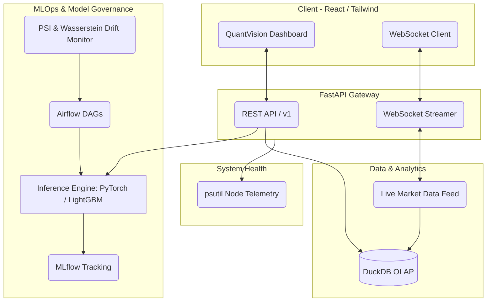

# QuantVision 📈🧠

[](https://reactjs.org/)
[](https://fastapi.tiangolo.com/)
[](https://pytorch.org/)
[](https://duckdb.org/)
[](https://mlflow.org/)
[](https://www.docker.com/)

**QuantVision** is a state-of-the-art Real-Time Quantitative AI Analytics & Production MLOps Platform designed for algorithmic trading, continuous model surveillance, and rigorous risk management. Built with modern, high-performance web and ML stacks, it bridges the gap between complex financial modeling and real-time operational governance.

---

## 📑 Table of Contents

- [Project Overview](#project-overview)
- [Core Technology Stack](#core-technology-stack)
- [Architecture & Modules](#architecture--modules)
- [System Architecture Diagram](#system-architecture-diagram)
- [Getting Started](#getting-started)
  - [Prerequisites](#prerequisites)
  - [Environment Configuration](#environment-configuration)
  - [Backend Setup](#backend-setup)
  - [Frontend Setup](#frontend-setup)
- [API Endpoints Overview](#api-endpoints-overview)
- [License](#license)

---

## 🚀 Project Overview

QuantVision acts as the nervous system for institutional-grade portfolio management and quantitative strategy execution. It delivers sub-15ms model inference latency alongside full-spectrum MLOps observability, allowing quantitative engineers and traders to monitor market conditions, track champion/challenger model drifts, simulate portfolios, and trigger automated retraining pipelines seamlessly.

---

## 🛠️ Core Technology Stack

- **Frontend Interface:** React, Vite, TailwindCSS (for high-fidelity dynamic visual data representation).
- **Backend & APIs:** FastAPI, WebSockets (for ultra-low latency real-time streaming).
- **Machine Learning Engine:** PyTorch (Deep Learning / Transformers), LightGBM (Gradient Boosting).
- **Analytical Data Engine:** DuckDB (In-memory/OLAP capabilities).
- **MLOps & Orchestration:** MLflow (Experiment tracking), Apache Airflow (DAGs for automated pipelines).
- **Telemetry & Health:** `psutil` integration for system hardware monitoring.

---

## 🧩 Architecture & Modules

### 1. Market & Technical Intelligence
* **Real-Time Market Feed & Heatmaps:** WebSocket streaming of tick-level asset data, visualizing sector performance and market momentum.
* **Technical & AI View:** Overlaying classical technical indicators (MACD, RSI, Bollinger Bands) with dynamic Model Inference Predictions for directional edge.
* **Sentiment & News Analytics Engine:** NLP-driven processing of macro news feeds and sentiment tracking.

### 2. Risk & Portfolio Analytics
* **Risk Analysis Engine:** Comprehensive metrics including Value at Risk (VaR), Conditional VaR (CVaR), and Max Drawdowns.
* **Portfolio Simulator & Backtesting Engine:** Institutional-grade backtester to simulate allocation strategies against historical regimes and AI predictions.

### 3. Stage 5 Automated Model Monitor & Production Drift Surveillance
* **Performance Telemetry:** Continuous tracking of core metrics: RMSE, MAE, Directional Accuracy, Inference Latency (sub-15ms), and Throughput.
* **Drift Detection:** Proactive monitoring of Feature Drift utilizing Population Stability Index (PSI) and Wasserstein Distance algorithms.
* **A/B Model Evaluation:** Live Champion vs. Challenger inference (e.g., PyTorch Transformer Multi-Head Attention vs. LightGBM Regressor / GRU).
* **Self-Healing Pipelines:** Automated Adaptive Subsampling & Auto-Retraining Engine when degradation thresholds are breached.

### 4. Admin & MLOps Governance Console
* **Restricted RBAC Security:** Role-Based Access Control ensuring strict permissions for model deployments and operations.
* **Hardware Telemetry via PSUTIL:** Live dashboarding of CPU, RAM, Disk utilization, and Node Latency.
* **Active Microservices Cluster Health:** Status tracking across API Server, ML Inference Engine, DuckDB, and WebSocket Streamer.
* **Operations Control Hub:** One-click manual retraining pipeline trigger directly mapped to `POST /api/v1/model/retrain`.

---

## 📐 System Architecture Diagram



---

## 🏁 Getting Started

### Prerequisites
* **Python** 3.10+
* **Node.js** 18+
* **Docker & Docker Compose** (Optional, for containerized deployments)

### Environment Configuration
Create a `.env` file in the root directory based on `.env.example`:
```env
# Example .env configuration
ENVIRONMENT=production
DB_CONNECTION_STRING=duckdb:///data/quantvision.db
MLFLOW_TRACKING_URI=http://localhost:5000
SECRET_KEY=your_secure_secret_key_here
```

### Backend Setup
1. Navigate to the backend directory:
   ```bash
   cd backend
   ```
2. Create and activate a virtual environment:
   ```bash
   python -m venv venv
   source venv/bin/activate  # On Windows: venv\Scripts\activate
   ```
3. Install dependencies:
   ```bash
   pip install -r requirements.txt
   ```
4. Start the FastAPI server:
   ```bash
   uvicorn main:app --reload --host 0.0.0.0 --port 8000
   ```

### Frontend Setup
1. Navigate to the frontend directory:
   ```bash
   cd frontend
   ```
2. Install dependencies:
   ```bash
   npm install
   ```
3. Start the Vite development server:
   ```bash
   npm run dev
   ```

---

## 🔌 API Endpoints Overview

QuantVision exposes a rich set of REST and WebSocket APIs for programmatic integration:

### REST Endpoints
* `GET /api/v1/health` - Check cluster health and microservice status.
* `GET /api/v1/telemetry` - Fetch hardware telemetry (CPU, RAM, Disk latency).
* `POST /api/v1/inference` - Request synchronous batch or single-record predictions.
* `POST /api/v1/model/retrain` - Trigger automated MLOps pipeline for model retraining.
* `GET /api/v1/model/metrics` - Retrieve RMSE, MAE, Directional Accuracy, and PSI metrics.

### WebSocket Channels
* `ws://<host>/ws/market` - Real-time market tick data streaming.
* `ws://<host>/ws/portfolio` - Live portfolio valuation and risk metric streaming.
* `ws://<host>/ws/telemetry` - Streaming node health and system analytics.

---

## 📄 License

Distributed under the MIT License. See `LICENSE` for more information.

---
*Built for scale, speed, and intelligence.* 🚀
